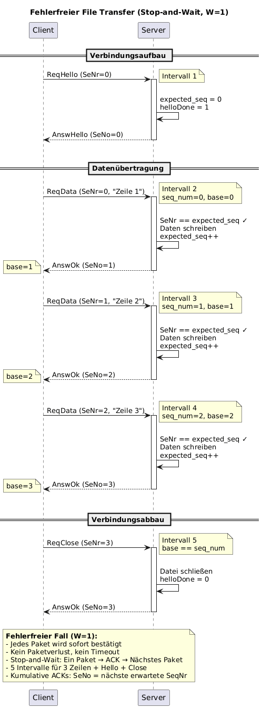
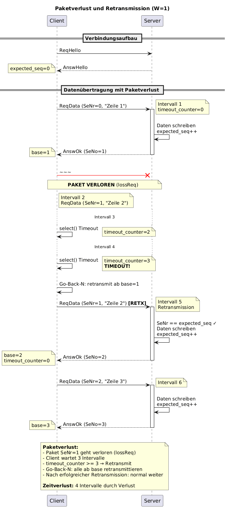
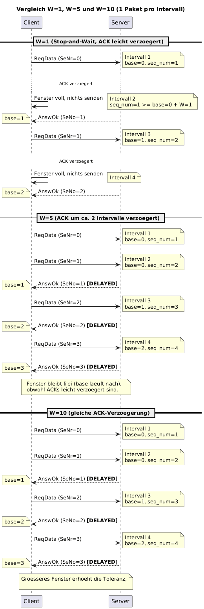
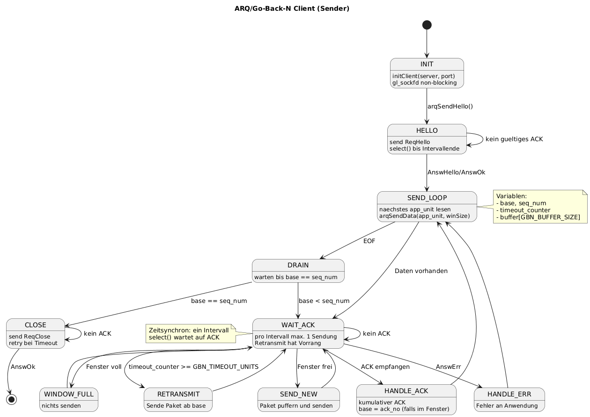
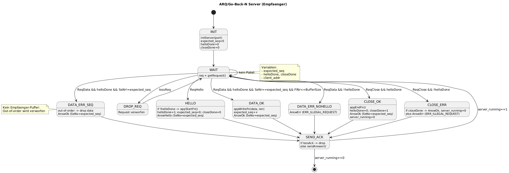

# Go-Back-N ARQ Protocol

Reliable file transfer over UDP/IPv6 using a sliding-window Go-Back-N protocol with configurable packet loss simulation. ~1,300 lines of C.

## Overview

A from-scratch implementation of the Go-Back-N Automatic Repeat Request protocol for reliable data transmission over unreliable UDP. The sender maintains a sliding window of unacknowledged packets with a ring buffer, uses cumulative ACKs to advance the window, and retransmits on timeout. The server can simulate both request and ACK loss to test protocol robustness under adverse network conditions.

## Architecture

```
+------------------+     +------------------+
|    client.c      |     |    server.c      |   Application Layer
|  (file reader)   |     |  (file writer)   |   CLI, file I/O
+------------------+     +------------------+
        |                         |
+------------------+     +------------------+
|   clientSy.c     |     |   serverSy.c     |   Protocol Layer
|   GBN sender     |     |   GBN receiver   |   ARQ, windowing, timers
+------------------+     +------------------+
        |                         |
        +---- UDP/IPv6 (SOCK_DGRAM) -----+   Transport Layer
```

Each layer has a clean interface boundary. The application layer handles file I/O and CLI parsing. The protocol layer implements Go-Back-N with no knowledge of what data it carries. The transport layer is raw UDP/IPv6 sockets.

### Key Design Decisions

- **Ring buffer** for unacknowledged packets (2x window size) — enables Go-Back-N retransmission without re-reading the file
- **Time-synchronous sending** — one packet per interval via `select()`, ensuring deterministic protocol behavior
- **Cumulative ACKs** — `SeNo` = next expected sequence number; all packets below are confirmed
- **Retransmit priority** — retransmissions are always sent before new data packets
- **No receiver buffering** — out-of-order packets are dropped (classic GBN tradeoff vs. Selective Repeat)

## Protocol

### Connection Lifecycle

1. **Handshake**: Client sends `ReqHello`, server responds with `AnswHello`
2. **Data transfer**: Sliding window with cumulative ACKs and timeout-based retransmission
3. **Drain**: Client waits until all in-flight packets are acknowledged
4. **Close**: Client sends `ReqClose`, server responds with `AnswOk`

### Error-Free Transfer (W=1)



### Packet Loss and Retransmission



### Window Size Comparison



### State Machines

**Client (Sender)**



**Server (Receiver)**



## Usage

### Build

```bash
make
```

### Run

```bash
# Terminal 1: Start the server
./build/server -p 3333 -f src/output.txt

# Terminal 2: Send a file with window size 5
./build/client -a ::1 -p 3333 -f src/input.txt -w 5
```

### Simulate Packet Loss

```bash
# 30% request loss, 10% ACK loss
./build/server -p 3333 -f src/output.txt -r 0.3 -a 0.1
./build/client -a ::1 -p 3333 -f src/input.txt -w 5
```

### Parameters

**Client**: `./client -a <server> -p <port> -f <file> -w <window>`

| Flag | Description | Default |
|------|-------------|---------|
| `-a` | Server address | `::1` (loopback) |
| `-p` | Server port | `3333` |
| `-f` | Input file to transfer | required |
| `-w` | Window size (1–10) | required |

**Server**: `./server -p <port> -f <outfile> [-r <lossReq>] [-a <lossAck>]`

| Flag | Description | Default |
|------|-------------|---------|
| `-p` | Listen port | `3333` |
| `-f` | Output file | required |
| `-r` | Request loss probability (0.0–1.0) | `0.0` |
| `-a` | ACK loss probability (0.0–1.0) | `0.0` |

## Configuration

Protocol parameters are defined in [`src/data.h`](src/data.h):

| Constant | Value | Purpose |
|----------|-------|---------|
| `GBN_MAX_WINDOW` | 10 | Maximum sliding window size |
| `GBN_BUFFER_SIZE` | 20 | Ring buffer slots (2x max window) |
| `GBN_TIMEOUT_INT_MS` | 100 | Interval duration in milliseconds |
| `GBN_TIMEOUT_UNITS` | 3 | Timeout = 3 intervals (300ms) |
| `BufferSize` | 512 | Maximum payload per packet |

## License

MIT
